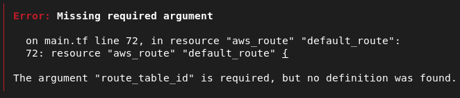
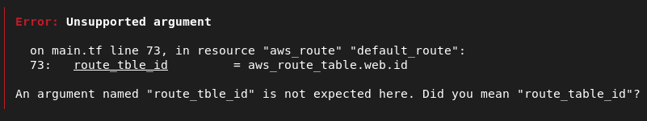
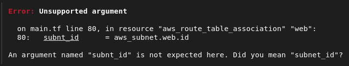
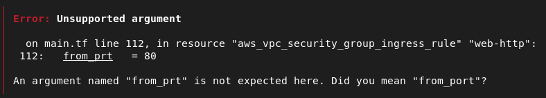
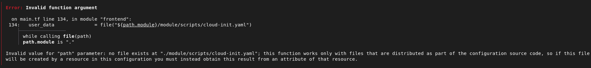
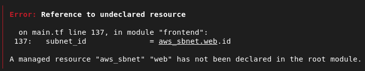
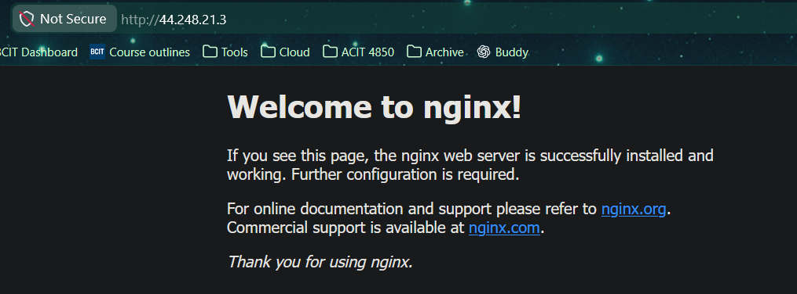

# 4640-in-class-wk14

## Team

- Angad Bains
- Misha Makaroff

## create new keys

```bash
ssh-keygen -t ed25519 -f ~/.ssh/aws
```

This command will create the ssh key in the .ssh directory of the user. It will create a `aws` private key and a `aws.pub` public key.

## run included scripts to import and delete keys

```bash
./scripts/import_lab_key /home/anges/.ssh/aws.pub
```

This will add the newly created key to our logged in aws account.

```bash
./scripts/delete_lab_key
```

This removes the key from our aws account, as it is no longer needed.

## Error Fixing

### Error 1



`route_tble_id` should be renamed to `route_table_id`. It was a spelling error.

### Error 2



On line 73, `route_tble_id` should be renamed to `route_table_id`. It was a spelling error.

### Error 3



On line 80, `subnt_id` should be renamed to `subnet_id`. It was a spelling error.

### Error 4



On line 112, `from_prt` should be renamed to `from_port`. It was a spelling error.

### Error 5



On line 134, `file("${path.module}/module/scripts/cloud-init.yaml")` is not the correct path compared to our file structure.

The correct path is: `file("${path.module}/scripts/cloud-init.yaml")`

### Error 6



On line 137, `aws_sbnet.web.id` should be renamed to `aws_subnet.web.id`. It was a spelling error.

## Successful Terraform Apply


